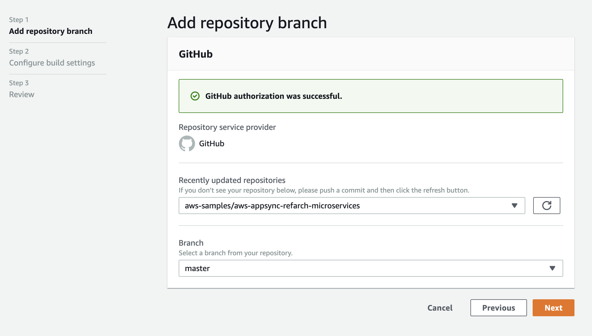
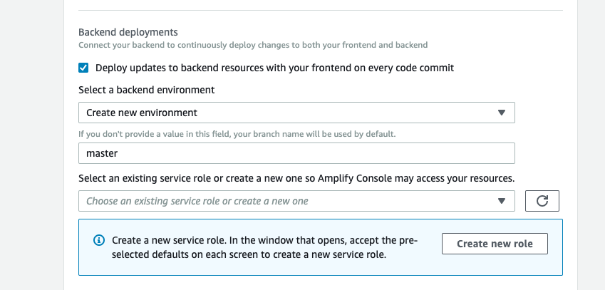
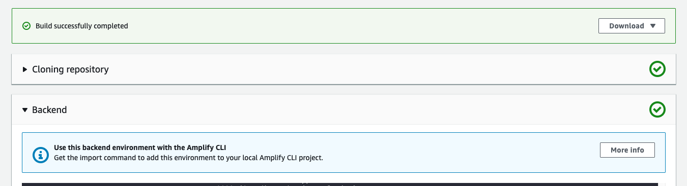

# AWS AppSync Microservices-Access-Layer Reference Architecture


The AWS AppSync Serverless GraphQL  microservice-access-layer reference architecture showcases AWS AppSync as a single interface to access and combine data from multiple microservices running in different environments :

- **UserService:** RESTful API built using  Amazon API Gateway and AWS Lambda
- **OrderService:** GraphQL API on different AWS AppSync endpoint
- **PaymentService:** Containerized service running inside an isolated VPC with no internet access

The sample app is based on a very simple webstore where users can login, and interact with different services. 


### Quicklinks

- [One-Click Deploy with the Amplify Console](#one-click-deploy-with-the-amplify-console)
- [Setup local environment](#setup-local-environment)
- [Clean Up](#clean-up)

## Getting Started

## One-Click Deploy with the Amplify Console

1. **Prerequisites**


- [AWS Account](https://aws.amazon.com/mobile/details) with appropriate permissions to create the related resources
- [AWS CLI](http://docs.aws.amazon.com/cli/latest/userguide/installing.html) with output configured as JSON `(pip install awscli --upgrade --user)`
- [Install Docker](https://docs.docker.com/install/)

- If using Windows, you'll need the [Windows Subsystem for Linux (WSL)](https://docs.microsoft.com/en-us/windows/wsl/install-win10)

- Create new Amazon Elastic Container Registry (Amazon ECR) (in the same region where amplify app will be deployed) and push payment application to container registry.

  ```bash
  git clone git@github.com:<username>/appsync-refarch-microserviceaccesslayer.git


  cd appsync-refarch-microserviceaccesslayer/paymentapp
  REPO=$(aws ecr create-repository --repository-name paymentapp --image-tag-mutability IMMUTABLE  --output text --query repository.repositoryUri)

  echo '# get-login'
  $(aws ecr get-login --no-include-email)

  echo '# repo'
  echo ${REPO}

  echo '# build docker image'
  docker build . -t python/paymentapp:v1

  echo '# tag this app as version 1'
  docker tag python/paymentapp:v1 ${REPO}:v1

  echo '# docker push'
  docker push ${REPO}:v1

  ```

2. Click the button to load the AWS Amplify Console. Amplify Console will build and deploy your backend and frontend in a single workflow. the end to end deployment should take around 20 minutes:

<p align="center">
    <a href="https://console.aws.amazon.com/amplify/home#/create" target="_blank">
        
    </a>
</p>

3. Connect your source code from a Git repository (select GitHub if you are cloning this sample), authorize AWS Amplify to connect to this reppository and select a branch.



4. Create new environment, branch and create an IAM role (with necessary permissions)



**Note:** If you use any other branch than master, make sure to update resource path in resolver mapping template `./amplify/backend/api/StoreApi/resolvers/Query.getUserInfo.req.vtl`. You can read more about configuring HTTP Resolver for AWS AppSync [here](https://docs.aws.amazon.com/appsync/latest/devguide/tutorial-http-resolvers.html)


5. Wait for the build, deployment and verification steps
6. Access your app from the hosted site generated by the Amplify Console(https://master.xxxxxxxx.amplifyapp.com)

## Setup local environment 

1. **Prerequisites**


- [NodeJS](https://nodejs.org/en/download/) with [NPM](https://docs.npmjs.com/getting-started/installing-node)
- [AWS Amplify CLI](https://github.com/aws-amplify/amplify-cli) configured for a region where [AWS AppSync](https://docs.aws.amazon.com/general/latest/gr/rande.html) and all other services in use are available `(npm install -g @aws-amplify/cli)`
- [Install JQ](https://stedolan.github.io/jq/)


2. You have already cloned the repo in previous step. Change directory to application root and install dependencies

```bash
cd appsync-refarch-microserviceaccesslayer && npm install
```

3. Select your app in amplify console. All Apps -> aws-appsync-refarch-microservices -> Backend Environment -> (extend) Edit backend at the bottom.




4. Paste this command into your terminal at the root of your repo (when prompted accept defaults for runtime and source path)

  ```
  amplify pull --appId <app-id-from-console> --envName <env-name>

  ? Do you want to use an AWS profile? Yes
  ? Please choose the profile you want to use default
  Amplify AppID found: xxxxxx1234sd. Amplify App name is: aws-appsync-refarch-microservices}
  Backend environment master found in Amplify Console app: aws-appsync-refarch-microservices
  ? Choose your default editor: Visual Studio Code
  ? Choose the type of app that you're building javascript
  Please tell us about your project
  ? What javascript framework are you using react
  ? Source Directory Path:  src
  ? Distribution Directory Path: build
  ? Build Command:  npm run-script build
  ? Start Command: npm run-script start

  ? Do you plan on modifying this backend? Yes

  Successfully pulled backend environment master from the cloud.
  Run 'amplify pull' to sync upstream changes.

  ```

5. Start and work on your front end locally. This will connect to the backend deployed in AWS.

  ```
  npm start
  ```


## Clean up 

To clean up the project, you can simply use;

```bash
amplify delete
```